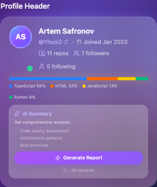
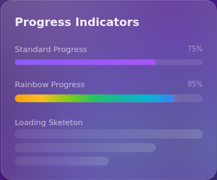
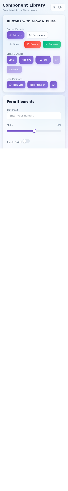
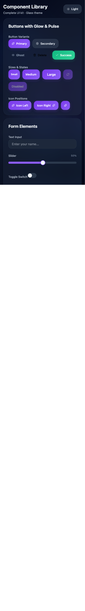

# shadcn-glass-ui

<div align="center">


**Glassmorphism UI components for React** — drop-in shadcn/ui compatible, AI-optimized

[Live Demo](https://yhooi2.github.io/shadcn-glass-ui-library/) |
[Storybook](https://yhooi2.github.io/shadcn-glass-ui-library/) |
[npm](https://www.npmjs.com/package/shadcn-glass-ui)

</div>

[](https://www.npmjs.com/package/shadcn-glass-ui)
[](https://www.npmjs.com/package/shadcn-glass-ui)
[](https://www.typescriptlang.org/)
[](docs/AI_USAGE.md)

---

## At a Glance

| Feature           | Details                                                                                 |
| ----------------- | --------------------------------------------------------------------------------------- |
| **Components**    | 58 total: 18 Core + 7 Atomic + 13 Composite + 7 Section + 10 Specialized + 3 Primitives |
| **Themes**        | Glass (dark), Light (clean), Aurora (gradient)                                          |
| **Stack**         | React 19, TypeScript 5.9, Tailwind 4.1, Vite 7                                          |
| **Testing**       | 1,570+ tests (802 visual + 650 compliance + 125 unit)                                   |
| **AI Support**    | Optimized for Claude, Copilot, GPT — [AI Guide](docs/AI_USAGE.md)                       |
| **Accessibility** | WCAG 2.1 AA, 44px touch targets, keyboard navigation                                    |
| **Bundle Size**   | ~110KB gzipped                                                                          |

---

## Quick Start

### Option 1: shadcn CLI (Recommended)

**For existing shadcn/ui projects.** Listed on [registry.directory](https://registry.directory).

1. Add registry to `components.json`:

```json
{
  "registries": {
    "@shadcn-glass-ui": {
      "url": "https://raw.githubusercontent.com/Yhooi2/shadcn-glass-ui-library/main/public/r"
    }
  }
}
```

2. Install components:

```bash
npx shadcn@latest add @shadcn-glass-ui/button-glass @shadcn-glass-ui/input-glass
```

[Full Registry Guide](docs/REGISTRY_USAGE.md)

### Option 2: npm Package

**For new projects.**

```bash
npm install shadcn-glass-ui
```

```tsx
import { ButtonGlass, ThemeProvider } from 'shadcn-glass-ui';
import 'shadcn-glass-ui/dist/styles.css';

function App() {
  return (
    <ThemeProvider defaultTheme="glass">
      <ButtonGlass variant="primary">Click me</ButtonGlass>
    </ThemeProvider>
  );
}
```

[Getting Started Guide](docs/GETTING_STARTED.md)

---

## Components

| Core UI                                                                                                                              | Composite                                                                                                        | Specialized                                                                                                                            |
| ------------------------------------------------------------------------------------------------------------------------------------ | ---------------------------------------------------------------------------------------------------------------- | -------------------------------------------------------------------------------------------------------------------------------------- |
|  |  |  |
| ButtonGlass, InputGlass, ModalGlass, TabsGlass...                                                                                    | MetricCardGlass, AICardGlass, YearCardGlass...                                                                   | SparklineGlass, StepperGlass, RainbowProgressGlass...                                                                                  |

[View All 58 Components](docs/COMPONENTS_CATALOG.md) |
[Interactive Storybook](https://yhooi2.github.io/shadcn-glass-ui-library/)

---

## Why shadcn-glass-ui?

| Standard shadcn/ui | shadcn-glass-ui                                  |
| ------------------ | ------------------------------------------------ |
| Flat design        | Glassmorphism effects (blur, glow, transparency) |
| Manual theming     | 3 built-in themes with token system              |
| Basic components   | 58 components including analytics widgets        |
| DIY accessibility  | WCAG 2.1 AA + touch targets out of the box       |
| Generic docs       | AI-optimized documentation                       |

**Seamless Integration:** Works alongside existing shadcn/ui components. Same patterns, same CLI.

---

## Component Categories

<details>
<summary><strong>Core UI (18)</strong> — Essential building blocks</summary>

ButtonGlass, InputGlass, CheckboxGlass, ToggleGlass, SliderGlass, ModalGlass, TabsGlass,
DropdownGlass, TooltipGlass, AlertGlass, NotificationGlass, BadgeGlass, AvatarGlass, GlassCard,
ProgressGlass, CircularProgressGlass, SkeletonGlass, ComboBoxGlass

</details>

<details>
<summary><strong>Atomic (7)</strong> — Single-purpose components</summary>

IconButtonGlass, ThemeToggleGlass, SearchBoxGlass, SortDropdownGlass, StatItemGlass,
ExpandableHeaderGlass, InsightCardGlass

</details>

<details>
<summary><strong>Composite (13)</strong> — Pre-built complex widgets</summary>

MetricCardGlass, YearCardGlass, AICardGlass, RepositoryCardGlass, TrustScoreDisplayGlass,
CircularMetricGlass, UserStatsLineGlass, UserInfoGlass, CareerStatsHeaderGlass,
ContributionMetricsGlass, MetricsGridGlass, RepositoryHeaderGlass, RepositoryMetadataGlass

</details>

<details>
<summary><strong>Section (7)</strong> — Full page sections</summary>

HeaderNavGlass, ProfileHeaderGlass, CareerStatsGlass, FlagsSectionGlass, TrustScoreCardGlass,
ProjectsListGlass, HeaderBrandingGlass

</details>

<details>
<summary><strong>Specialized (10)</strong> — Advanced components</summary>

StatusIndicatorGlass, SegmentedControlGlass, RainbowProgressGlass, LanguageBarGlass,
ProfileAvatarGlass, FlagAlertGlass, BaseProgressGlass, SparklineGlass, StepperGlass (compound API
with 3 variants)

</details>

[Full Component Catalog](docs/COMPONENTS_CATALOG.md)

---

## Themes

| Glass (Dark)                                                                                                                    | Light                                                                                                                           | Aurora                                                                                                                            |
| ------------------------------------------------------------------------------------------------------------------------------- | ------------------------------------------------------------------------------------------------------------------------------- | --------------------------------------------------------------------------------------------------------------------------------- |
|  |  |  |
| Frosted glass effects                                                                                                           | Clean minimal                                                                                                                   | Gradient glow                                                                                                                     |

```tsx
import { ThemeProvider, useTheme } from 'shadcn-glass-ui';

function ThemeSwitcher() {
  const { theme, cycleTheme, setTheme } = useTheme();
  return <button onClick={cycleTheme}>Current: {theme}</button>;
}
```

[Theme Creation Guide](docs/THEME_CREATION_GUIDE.md) — Create custom themes in 15 minutes

---

## FAQ

<details>
<summary><strong>How do I migrate from v1.x to v2.0?</strong></summary>

v2.0 renames CSS variables to semantic names. Run the automated migration:

```bash
find src/ -type f \( -name "*.tsx" -o -name "*.css" \) -exec sed -i '' \
  -e 's/--metric-emerald-/--metric-success-/g' \
  -e 's/--metric-amber-/--metric-warning-/g' \
  -e 's/--metric-blue-/--metric-default-/g' \
  -e 's/--metric-red-/--metric-destructive-/g' {} +
```

[Full Migration Guide](docs/BREAKING_CHANGES.md)

</details>

<details>
<summary><strong>Does it work with existing shadcn/ui components?</strong></summary>

Yes! Glass components use the same patterns and can coexist with standard shadcn/ui components.

</details>

<details>
<summary><strong>What are the requirements?</strong></summary>

- React 18.0+ or 19.0+
- Tailwind CSS 4.0+
- Node.js 20.16+

</details>

<details>
<summary><strong>How do I use with AI assistants?</strong></summary>

See our [AI Usage Guide](docs/AI_USAGE.md) with decision trees for Claude, Copilot, and GPT. The
library is indexed on [Context7](https://context7.com/yhooi2/shadcn-glass-ui-library).

</details>

<details>
<summary><strong>Where are the breaking changes documented?</strong></summary>

- [BREAKING_CHANGES.md](docs/BREAKING_CHANGES.md) — Consolidated v1.0 and v2.0 changes
- [CHANGELOG.md](CHANGELOG.md) — Complete version history
- [Migration Guides](docs/migration/) — Step-by-step migration

</details>

---

## Documentation

| Resource                                                       | Description                 |
| -------------------------------------------------------------- | --------------------------- |
| [Storybook](https://yhooi2.github.io/shadcn-glass-ui-library/) | Interactive component demos |
| [Getting Started](docs/GETTING_STARTED.md)                     | Setup tutorial              |
| [Component Catalog](docs/COMPONENTS_CATALOG.md)                | All 58 components           |
| [AI Usage Guide](docs/AI_USAGE.md)                             | For Claude, Copilot, GPT    |
| [Theme Guide](docs/THEME_CREATION_GUIDE.md)                    | Create custom themes        |
| [Token Architecture](docs/TOKEN_ARCHITECTURE.md)               | 3-layer CSS token system    |
| [Advanced Patterns](docs/ADVANCED_PATTERNS.md)                 | asChild, Compound APIs      |
| [Breaking Changes](docs/BREAKING_CHANGES.md)                   | Migration guides            |

## CLI

```bash
npx shadcn-glass-ui info button    # Component info (fuzzy search)
npx shadcn-glass-ui list           # List all components
npx shadcn-glass-ui list --category=core  # Filter by category
```

---

## Contributing

We welcome contributions! See [CONTRIBUTING.md](CONTRIBUTING.md).

## License

MIT — See [LICENSE](LICENSE)

## Credits

Built with [shadcn/ui](https://ui.shadcn.com/), [Radix UI](https://www.radix-ui.com/),
[Tailwind CSS](https://tailwindcss.com/), [Vite](https://vitejs.dev/)

---

<div align="center">

**[Star on GitHub](https://github.com/Yhooi2/shadcn-glass-ui-library)** if you find this useful!

[](https://star-history.com/#Yhooi2/shadcn-glass-ui-library)

</div>
